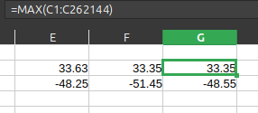
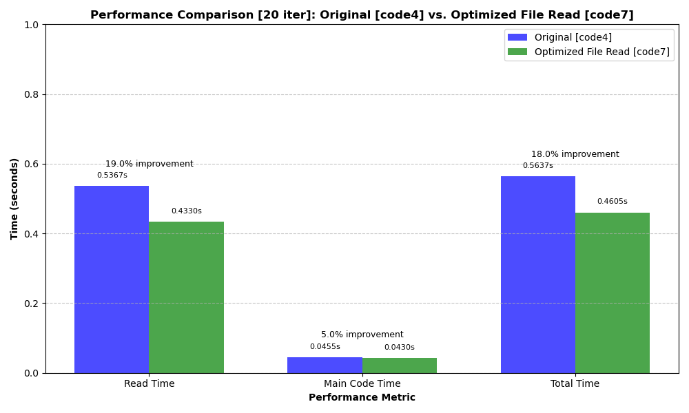
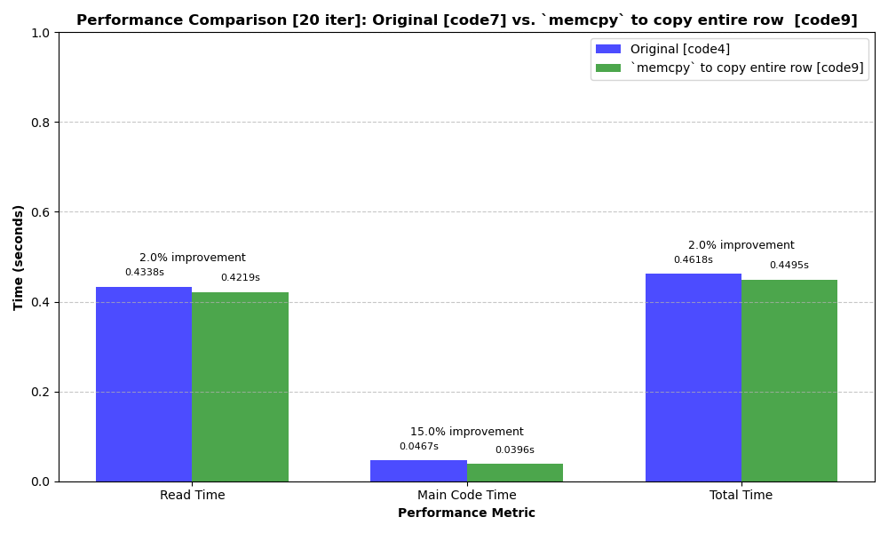
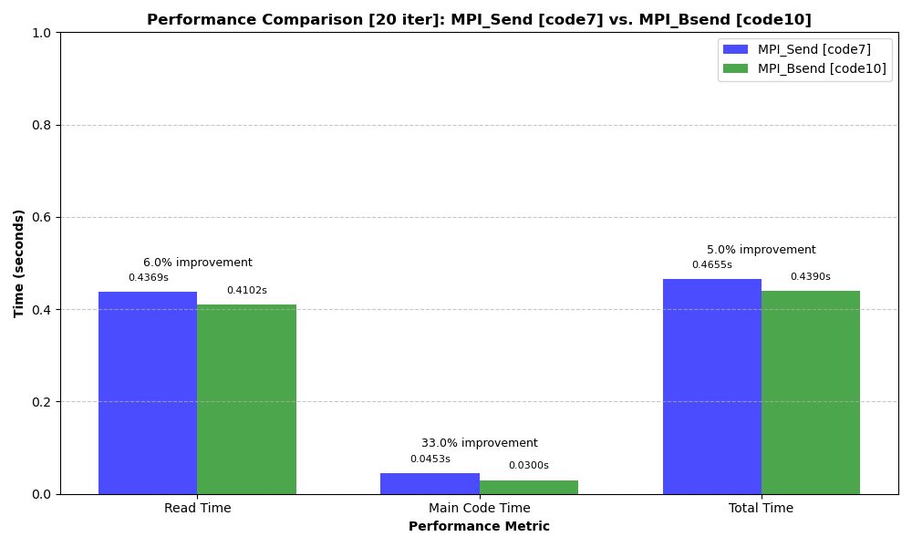
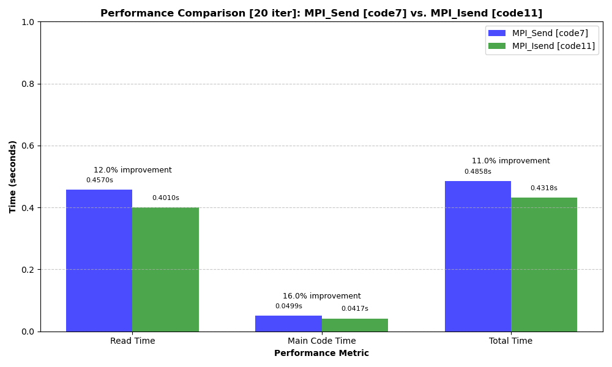

# CS633-Assignment

## Compilation
To compile the code use:

```bash
mpicc -o pankaj_code2 pankaj_code2.c
```

## Running the Program
To run the code use:

```bash
mpirun -np 8 ./pankaj_code2 test.txt 2 2 2 64 64 64 3 out.txt
```

## Expected Output
results for small file (64,64,64,3) are as follows:

```
(37988, 37991), (37826, 38005), (37788, 37978)
(-48.25, 33.63), (-51.45, 33.35), (-48.55, 33.35)
0.0281498, 0.0146346, 0.0333589
```

results for big file (64,64,96,7) are as follows:

```
(56875, 56848), (56703, 56965), (56680, 56847), (56601, 56980), (56769, 56937), (56657, 56950), (56862, 56996)
(-48.25, 33.63), (-51.45, 33.35), (-48.55, 33.35), (-43.13, 32), (-53.55, 34.06), (-49.68, 34.18), (-53.55, 34.34)
0.0517977, 0.0257735, 0.0620756
```

## global minima and maxima verified from csv.
The output has been verified against the original data source:


## Performance Comparison
I've created several implementations with different optimization techniques.  results comparing without and with file reading optimization.



results comparing without and with memcpy



results comparing with MPI_Send and with MPI_Bsend



results comparing with MPI_Send and with MPI_Isend



results


The performance testing was conducted using the benchmark script (`benchmark.sh`), which runs each implementation 20 times and calculates average performance metrics.


### Performance Testing Tools
Two utility scripts were created for performance analysis:
- `benchmark.sh`: Runs multiple iterations of each implementation and calculates average performance
- `plot_results.py`: Creates visualizations of the performance data

To run the performance comparison yourself:
```bash
# Run the benchmark
./benchmark.sh

# Generate the performance visualization
python3 plot_results.py
```
